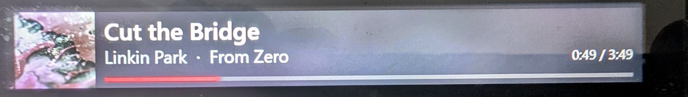
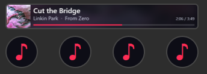

# Full Strip for YTMD

Un plugin Stream Deck + qui utilise **toute la largeur du bandeau tactile** pour
afficher ce que joue [YouTube Music Desktop](https://github.com/ytmdesktop/ytmdesktop) :
pochette, titre, artiste, album, progression.

Le bandeau du Stream Deck + n'est pas quatre petits écrans, c'est **un seul écran de
800 × 100 px** découpé en quatre zones de 200 × 100. Le SDK ne laisse un plugin peindre
que sa propre zone — mais rien n'empêche de composer une image de 800 × 100, de la
découper en quatre et d'en pousser une tranche par encodeur. Les tranches se raboutent
sans couture visible.

C'est tout ce que fait ce plugin.



Sur le matériel, aucune couture n'est visible entre les quatre zones — c'est tout l'enjeu
du découpage.



Le découpage, lui, est bien réel :

```
┌─────────────────────────────────────────────────────────────────┐
│ ▓▓▓▓▓  Cut the Bridge                                           │
│ ▓▓▓▓▓  Linkin Park · From Zero                      0:49 / 3:49 │
│ ▓▓▓▓▓  ████████░░░░░░░░░░░░░░░░░░░░░░░░░░░░░░░░░░░░░░░░░░░░░░░░ │
└──dial 1───────┴──dial 2───────┴──dial 3───────┴──dial 4────────┘
     0-200px         200-400px       400-600px       600-800px
```

## Fonctionnalités

- Pochette de l'album à gauche, en 100 × 100 net, plus la même pochette floutée et
  assombrie en fond sur toute la largeur
- Titre, artiste et album, tronqués proprement s'ils débordent
- Barre de progression et minutage, rafraîchis à la seconde
- Affichage grisé avec indicateur ⏸ en pause
- **Rotation** = volume · **appui ou tap** = lecture/pause
- Mises à jour par **push** (~270 ms), pas de polling en régime nominal
- Hôte, port et nombre d'encodeurs configurables — voir [Configuration](#configuration)

## Prérequis

- **Stream Deck +** (le bandeau tactile et les encodeurs sont indispensables)
- Logiciel Stream Deck **6.9** ou plus (exigé par le Marketplace, qui impose `SDKVersion 3`)
- YouTube Music Desktop avec le **serveur companion activé**
- Windows (voir « Portabilité » plus bas)

## Installation

1. Copier `src/dev.74nu5.ytmdstrip.sdPlugin` dans
   `%APPDATA%\Elgato\StreamDeck\Plugins\`
2. Redémarrer le logiciel Stream Deck
3. Dans YTMD : **Settings → Integrations**, activer *Companion Server* **et**
   *Enable companion authorization*
4. Poser l'action **Full Strip** sur les **quatre** encodeurs
5. Le bandeau affiche un code à quatre chiffres — l'approuver dans YTMD

L'autorisation n'est demandée qu'une fois : le jeton est ensuite conservé dans les
*global settings* de Stream Deck.

> Pour n'utiliser que 1, 2 ou 3 encodeurs, ajuste le réglage **Encodeurs** dans le
> panneau de l'action — voir [Configuration](#configuration).

## Ce que le plugin attend de YTMD

L'API companion, telle qu'exposée par YTMD sur `http://127.0.0.1:9863` :

| Endpoint | Usage |
| --- | --- |
| `/metadata` | versions disponibles — **non** préfixé par `/api/v1` |
| `/api/v1/auth/requestcode` | `POST {appId, appName, appVersion}` → `{code}` |
| `/api/v1/auth/request` | `POST {appId, code}` → `{token}` (bloque jusqu'à approbation) |
| `/api/v1/state` | état courant (repli seulement) |
| `/api/v1/command` | `POST {command, data}` |
| `/api/v1/realtime` | namespace socket.io, événement `state-update` |

## Pièges rencontrés

Ces quatre points ont coûté l'essentiel de la mise au point. Ils sont documentés ici
pour la personne suivante.

**1. `requestcode` renvoie 403 sans explication.**
C'est volontaire : YTMD refuse d'émettre des jetons tant que *Enable companion
authorization* n'est pas coché. Ce réglage se redésactive tout seul au bout d'un
moment ; il suffit qu'il soit actif au moment de la demande.

**2. Le `GET /state` est mis en cache par le navigateur.**
La page d'un plugin Stream Deck est une page Chromium, et un `fetch` en boucle sur la
même URL ressert la première réponse indéfiniment. L'affichage se fige alors sur le
premier échantillon, sans la moindre erreur nulle part. `cache: 'no-store'` est
obligatoire.

**3. Un `setVolume` par cran de molette déclenche un HTTP 429 en cascade.**
YTMD limite le débit. Une rotation un peu vive génère des dizaines de POST, le serveur
répond 429 — et refuse ensuite **aussi la socket temps réel**. Le plugin retombe alors
sur le polling, qui se prend un 429 à son tour. Le symptôme visible (« l'affichage n'est
plus temps réel ») est très éloigné de la cause. Les commandes de volume sont donc
coalescées à une toutes les 200 ms, la dernière valeur étant poussée au relâchement.

**4. L'en-tête d'authentification est le jeton brut.**
`Authorization: <token>`, sans `Bearer`.

## Notes d'implémentation

**Pas de dépendance socket.io.** Le protocole Engine.IO v4 est parlé directement sur une
WebSocket brute, en une soixantaine de lignes : `0{…}` ouverture, `40<ns>,<authJSON>`
connexion au namespace, `42<ns>,[event,data]` événement, `2`/`3` ping/pong. Embarquer
40 Ko de bibliothèque pour ça n'en valait pas la peine.

**Le canvas doit rester « propre ».** Les pochettes sont chargées en
`fetch → blob → ImageBitmap`, avec repli sur ``. Un simple
`` distant teinterait le canvas et `toDataURL()` lèverait une `SecurityError` —
échec parfaitement silencieux, puisqu'il survient au moment de pousser les pixels.

**Le repaint est cadencé, pas le push.** Les événements arrivent ~3,7 fois par seconde,
mais l'image n'est recomposée que lorsque la seconde entière change, ou que le titre,
l'état de lecture ou la pochette changent. Inutile de pousser quatre PNG quatre fois par
seconde pour un affichage identique.

**Le métronome Worker est défensif.** Les timers des pages en arrière-plan *peuvent*
être bridés par Chromium ; ceux d'un Worker y échappent. Cela dit, le bridage n'a pas
été prouvé sur ce moteur — les ~5 s observées pendant la mise au point venaient en
réalité du piège n° 3. `setInterval` suffirait probablement.

## Portabilité

Le manifeste déclare **Windows uniquement**. Le code est du JavaScript pur, sans rien de
spécifique à la plateforme : il devrait fonctionner tel quel sur macOS en ajoutant

```json
{ "Platform": "mac", "MinimumVersion": "10.15" }
```

au tableau `OS`. Ce n'est pas déclaré parce que ça n'a **pas été testé** — mieux vaut un
manifeste honnête qu'une compatibilité annoncée à l'aveugle. Retour d'expérience macOS
bienvenu.

## Configuration

Le panneau de réglages (clic sur l'action dans le logiciel Stream Deck) expose :

| Réglage | Défaut | Rôle |
| --- | --- | --- |
| **Status** | — | Voyant de connexion : autorisé, temps réel actif, mode dégradé, erreur |
| **Host** | `127.0.0.1` | Machine faisant tourner YTMD |
| **Port** | `9863` | Port du serveur companion |
| **Dials** | `4` | Nombre de tranches — l'image est composée en `n × 200` px |
| **Reset authorization** | — | Oublie le jeton et redemande un code |

Les réglages sont **globaux** : ils valent pour tous les encodeurs à la fois, pas besoin
de les répéter quatre fois.

Le réglage **Dials** permet de n'occuper que 1, 2 ou 3 encodeurs si tu veux garder les
autres pour autre chose : l'image est alors composée à la largeur correspondante au lieu
d'être tronquée. Pose l'action sur ce nombre d'encodeurs, en partant de la gauche.

> L'interface du plugin (panneau de réglages, messages du bandeau, journaux) est en
> **anglais**, le Marketplace étant international. Cette documentation reste en français.

## Limites connues

- Les titres trop longs sont tronqués (pas de défilement) — le défilement imposerait un
  repaint continu de tous les dials
- Le volume n'est pas affiché sur le bandeau pendant la rotation
- Avec 1 seul encodeur, la place restante après la pochette est très étroite (76 px)

## Licence

MIT — voir [LICENSE](LICENSE).

Ce projet n'est ni affilié à Elgato, ni à YouTube Music Desktop, ni à Google. « YouTube »
et « YouTube Music » sont des marques de Google LLC ; elles ne sont mentionnées ici qu'à
titre descriptif.
